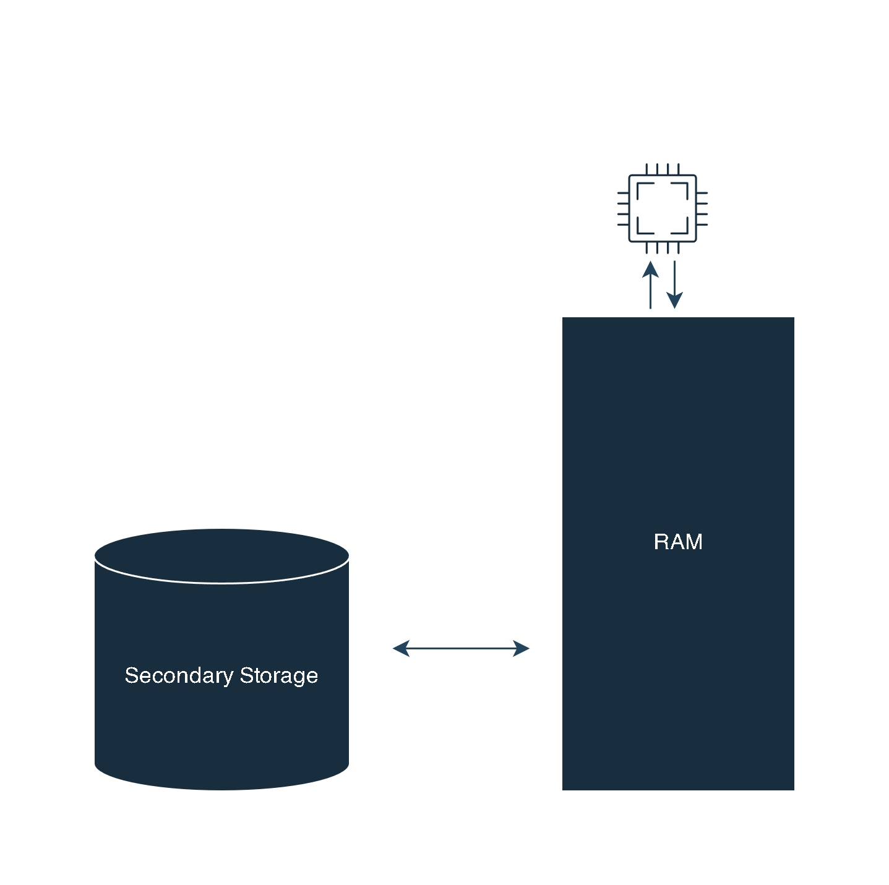

# Basics Of Data Structures (Concepts)
## What is Data Structure ?
- Data Structure is an arrangement or collection of data items, so that operations on data can be perform efficiently.
- During the execution of program, how te program will manage data and perform the operations efficiently is data structure.

- When we install any application, it gets install on secondary storage.
- When we click on any applicaion, an application program loaded into the main memory.

## Stack vs Heap

- Memory is divided into smaller addressible unit called as bytes.
- Addresses are linear.
- Memory is divided into manageable pieces called segments

### Stack
- Static Memory allocation means how many bytes of memory required to a function decided at compile time.
- Activation records or stack frame created for each function call.
- How much memory required by function depends on number of variables and their sizes decided by compiler only.

### Heap
- Heap Memory is treated like resource
- For Example : A system wants to use a printer so it request for a printer and use it, after using it will release the resource (Printer).
- Program cannot directly access heap memory. It an access only code and stack section.
- To access heap memory we need pointer.

## Physical and Logical Data Structure

### Physical Data Structure
#### Array
- Fixed Size
- Can be created inside Heap or Stack
- Collection of data at contiguious memory location

#### Linked List
- Can grow and reduce
- Always created in heap
- Chain of node containing data and address of next node.

### Logical Data Structure
- Linear
1) Stack
2) Queue

- Non-Linear
1) Tree
2) Graph

- Linear or Non-Linear
1) Hash Table

